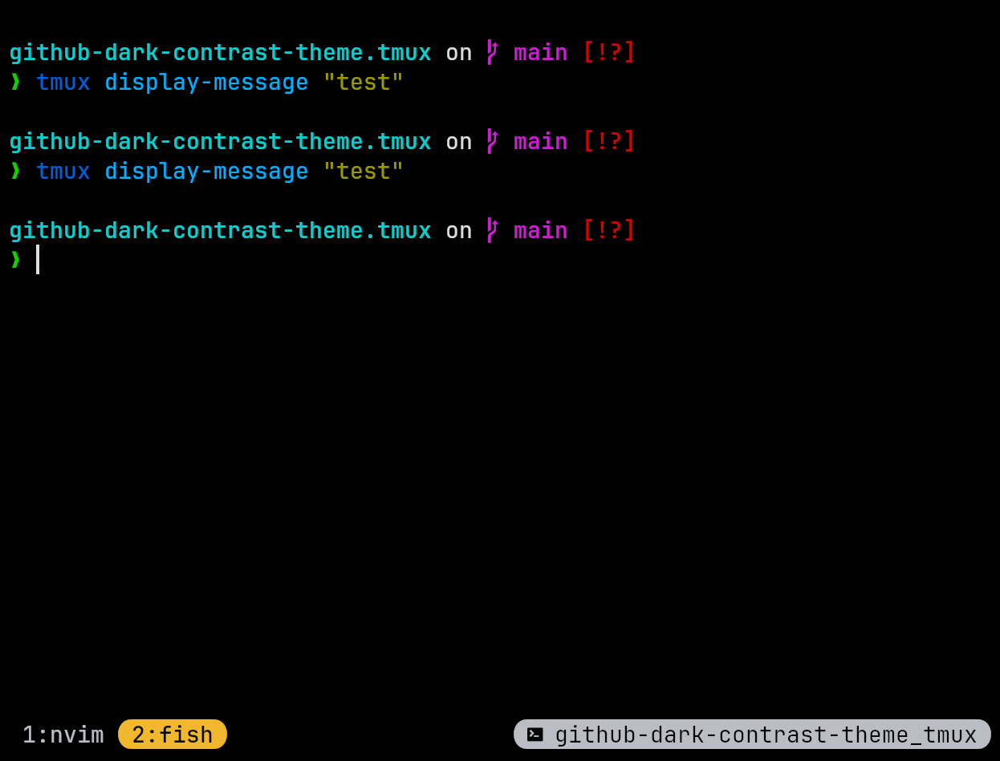

# github-dark-contrast-theme.tmux

Tmux theme that is based on my neovim theme

<div align="center">
	
</div>

## How to install

Using tpm:

```
set -g @plugin 'Peanutt42/github-dark-contrast-theme.tmux'
```

(dont forget to press `<prefix>I` to install the tpm plugin)

Manually:

1. Copy contents of `./github_dark_contrast.tmux` into your `~/.tmux.conf` or `~/.config/tmux/tmux.conf`
2. Reload your tmux configuration (for ex. with `tmux source-file ~/.tmux.conf`)

<br>

## Also look at:

- neovim theme "GitHub Dark Contrast" which this tmux theme is based on: [github-dark-contrast-theme.nvim](https://github.com/Peanutt42/github-dark-contrast-theme.nvim)

- .tmTheme file for the same theme syntax highlighting for `bat`/`delta`: [github-dark-contrast-theme.tmTheme](https://github.com/Peanutt42/github-dark-contrast-theme.tmTheme)

- delta "feature"(/theme) that uses the .tmTheme: [github-dark-contrast-theme.delta](https://github.com/Peanutt42/github-dark-contrast-theme.delta)

- lazygit theme: [github-dark-contrast-theme.lazygit](https://github.com/Peanutt42/github-dark-contrast-theme.lazygit)
